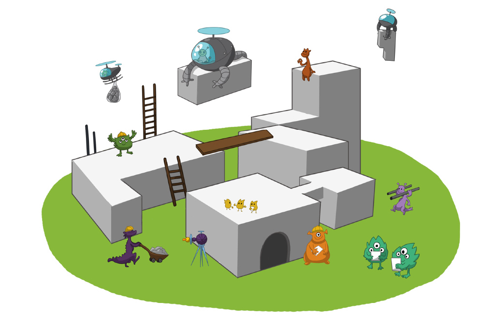

==============================================
The Standardization Survival Kit: presentation
==============================================

To support the digital turn of Social Sciences and Humanities research,
it is necessary to stabilize knowledge on standards and research good practices.
The goal of the **Standardization Survival Kit**, developed within the `PARTHENOS project <http://parthenos-project.eu>`_ project, is to accompany researchers along this way, giving access to standards and best practices in a meaningful way, by the mediation of research scenarios. These scenarios are at the core of the SSK, as they embed resources with contextual information and relevant examples on standardized processes and methods in a research context. The SSK in an open tool where users are able to publish new scenarios or adapt existing ones. Those scenarios can be seen as a living memory of what should be the best research practices in a given community, made accessible and reusable for other researchers.

Why standards after all?
------------------------

The main issue in defining a policy about standards is to understand what they actually are. Standards usually take the form of documents informing about practices, protocols, artefact characteristics or data formats that can be used as reference for two parties working in the same field of activity to be able to produce comparable (or interoperable) results. This will also foster innovative, cross-disciplinary research paths, and eventually contribute to bridge the gap between the different cultures that are represented in the wide landscape of the Humanities and Cultural Heritage studies.

Standards are usually published by standardization organisations (such as ISO, W3C or the TEI Consortium), which ensure that the following three requirements for standards are actually fulfilled:

- Expression of a consensus: the standard should reflect the expertise of a wide (possibly international) group of experts in the field
- Publication: the standard should be accessible to anyone who wants to know its content
- Maintenance: the standard is updated, replaced or deprecated depending on the evolution of the corresponding technical field

Standards are not regulations. There is no obligation to follow them except when one actually wants to produce results that can be compared with those of a wider community. This is why a standardization policy for an infrastructure in the Arts and Humanities should include recommendations as to what attitude the scholarly communities could or should adopt with regard to specific standards.

The preceding characteristics outlined for standards put a strong emphasis on the role of communities of practice and the corresponding bodies that represent them. Ideally, a good standard reflects the work of the relevant community and is maintained by the appropriate body. This is exactly the case of the `Text Encoding Initiative <http://tei-c.org/>`_ with respect to text representation standards and, to a lesser extent, of `EAD (Encoded Archival Description) <http://loc.gov/ead>`_, whose maintenance is taken up by the `Library of Congress <http://loc.gov>`_ with support of the `Society of American Archivists <https://www2.archivists.org/>`_.

Because there is no obligation to use a given standard, it is essential to provide potential users with:

a) awareness about the appropriate standards and the interest to adopt them,
b) the cognitive tools to help them identify the optimal use of standards through selection and possibly customization of a reference portfolio.

The experience gained within the various communities and infrastructure represented in `PARTHENOS <http://parthenos-project.eu>`_ that have been in the need of adopting existing standards, is that there is always an initial phase during which scholars should be made aware of some core standards that are systematically related to the definition of interoperable digital objects. This is basically what has lead us to identify the notion of Standardization Survival Kit (SSK). In the table below for instance, we can see a first group of standards without which it is more or less impossible to deal with digital content in a proper way.

+----------------+-----------------------------------------------------------------+
| ISO 639 series | Codes for the representation of languages and language families |
+----------------+-----------------------------------------------------------------+
| ISO 15924      | Codes for the representation of scripts                         |
+----------------+-----------------------------------------------------------------+
| ISO 3166       | Codes for the representation of country names                   |
+----------------+-----------------------------------------------------------------+
| IETF BCP 47    | Standard for encoding linguistic content,                       |
|                | combining ISO 639, ISO 15924 and ISO 3166                       |
+----------------+-----------------------------------------------------------------+
| ISO 10646      |Universal encoding of characters (unicode)                       |
+----------------+-----------------------------------------------------------------+
| ISO 8601       | Representation of dates and times                               |
+----------------+-----------------------------------------------------------------+
| XML            | Provides the basic technical concept related to XML documents   |
+----------------+-----------------------------------------------------------------+

The concept of SSK goes far beyond these baseline examples and aims at covering reference digital scenarios in the Arts and Humanities: a role of the SSK is to help communities participate in standardization activities where they exist. Such a strategy will also contribute to the actual stabilization of existing conceptual and technical knowledge within ongoing projects, and provide a channel for the wider dissemination of the corresponding results.

The SSK: a toolkit for Humanities scholars
------------------------------------------

Because there is no obligation to use a given standard, it is essential
to provide potential users with:

#. an awareness of the appropriate standards and the advantages to be gained by adopting them,
#. the cognitive tools to help them identify the optimal use of standards through the selection and possibly customisation of a reference portfolio.

The work carried out by the SSK covers four types of activities related to the deployment and use of standards in the Humanities and Cultural Heritage fields:

-  **Documenting** existing standards to provide reference for scholars who want to find out more about their role and content. This relates to the specific provision of bibliographic sources, available documentation, specific targeted introductions, as well as providing prototypical examples which can serve as models for similar work, possibly made available through focused Virtual Research Environments within the PARTHENOS infrastructure;

-  **Supporting** the actual adoption of standards by identifying how they relate to research scenarios and gathering the essential materials for controlling their deployment (e.g. schemas);

-  **Communicating** with research communities so that they can be made aware of both the need to apply standards in their digital scholarly practices but also be informed of the essential standards for their own fields.

-  **Training** for researchers, by giving them access to complete frameworks so that they may acquire knowledge and know-how on standardized methodologies.

In order to apply these four principles, the SSK focuses on giving
researchers access to standards in a meaningful way. That is why it is
built around research scenarios.

These scenarios are the core of the SSK
because they aim at providing **contextual information** and relevant
**examples** on how standards can be applied in a given research
project. They cover **all the domains of the Humanities**, from
Literature to Heritage science, including History, Social sciences,
Linguistics, etc.

They have been created and they are added to by domain
experts, from **real life researcher-oriented use cases (PARTHENOS,
2016)**, divided into different steps, and involving specific tasks.

These scenarios can be seen as a living memory of what should be the
best research practices in a given community, made accessible and
reusable for other researchers wishing to carry out a similar project
but unfamiliar with the recommended tools, formats, methods to use, etc.
For that reason, the SSK can be considered as a **complete framework**
showing concrete use of standards, rather than simply a catalog of
resources.

Design principles & features of the SSK
--------------------------------

From the very start of the project, the aim has been to build an **easy-to-use** online and
collaborative platform with a **user-friendly** design. The idea of having general, end-to-end
scenarios to help researchers carry out their project by
following best practices and clear methods in their area of expertise is
the most important design principle for the SSK.

The second principle is to add **context**: a “story-telling” approach
to the use of digital standards in the Humanities and Social Sciences.
The goal is to avoid providing yet another catalog of resources, and offer instead
contextual, **activity-based information** on how to use standards for
researchers who are unfamiliar with them, but could see
how they are used and what workflow they help achieve by following a scenario.

With these principles in mind, the SSK should enable you, the user, to perform
two main actions:

#. **consult and follow the guidelines expressed in the scenarios** your are interested in for your project. Finding the most
   relevant ones should be easy since the navigation relies on strong taxonomies
   covering the different aspects of research : the disciplines, the
   type of techniques and objects involved, the concrete activities
   carried out, the standards needed.

#. **propose new scenarios** of your own by following a predefined
   model, with the possibility of both adding new content (steps as
   well as resources) and reusing existing content (to avoid duplication if
   a general step is already available in another scenario).

The first feature is fully operational. It was tested for the first
time in April 2018, and iterations with test users have contributed to improve the **information readability** and
**attractiveness**.

The work on the second feature, allowing the user to contribute, is still ongoing. It is possible to create research scenarios
with the SSK underlying data model, the TEI (see :ref:`reTEI` for more information). However, as we are aware that this solution requires some technical knowledge, a user-friendly interface is currently under development and should be released during the first trimester 2019.

Anyone who has registered and agreed to the “\ **Terms of use**\ ” clearly
stated before starting a contribution. This option has been chosen due
to the difficulties of setting up some kind of editorial board in charge of reviewing any scenarios submitted. The **quality check**
of the contributions should come from the very strict model that has to
be followed in the scenario creation process. In addition, by contributing
to the SSK, the user accepts to be visible and citable as an author ;
you are responsible for the work you decide to share with others.

Why would you, as a researcher, want to contribute to the SSK ? There are three main reasons:

-  to make your research project align with the best practices in
   your community

-  to get peer review and visibility

-  to share a project in another form than the usual blog / article (a new
   way to disseminate your work).

SSK components
--------------

The SSK is a web platform builded on three main layers nested within
each other following a specific order: Research scenarios, steps and resources.

Scenarios < Steps < Resources
~~~~~~~~~~~~~~~~~~~~~~~~~~~~~

Each **scenario** within the SSK works like a high-level research guide
for scholars. They are made up of successive **steps** or tasks, and can
be followed as a complete process to solve a given problem with the most
standardized means. For each step, the appropriate **resources** to
perform the given task are proposed, divided into two categories : the
“\ **general resources**\ ” that include the primary documentation and
tools; and the “\ **project-specific resources**\ ” that point to
concrete use cases in which a similar task was accomplished. The
material contained in these sections is of various kinds:

-  the most important is the **state-of-the-art bibliography**, which includes all the documentation needed to carry out a given task. The bibliographical references are up-to-date and gathered within a `Zotero library <https://www.zotero.org/groups/427927/ssk-parthenos>`_, which was specially created for this project. This choice was made to ease the resource selection process and to allow for a collaborative watch and curation of relevant information. When the resource is available online, a direct link is provided ; otherwise, the user is given all the necessary metadata.

-  the SSK also offers the possibility to point to more **technical resources**, such as stylesheets, code samples, software or services.

-  **Training materials** like tutorials.

How to create a scenario for the SSK
~~~~~~~~~~~~~~~~~~~~~~~~~~~~~~~~~~~~

The following instructions help users create a scenario for the SSK. They are themselves conceived as a "scenario", a step-by-step tutorial. First, contributors should be aware that:

* they can submit their new scenarios directly in TEI and upload them on the SSK GitHub (http://github.com/ParthenosWP4/SSK), or by using the dedicated SSK contribution workspace (still work in progress).
* scenarios and steps follow the same data model. The difference is that a scenario points to a set of steps whereas a step points to a set of external resources.
* It is possible to create a scenario in any language, as long as contributors are sure that it can be useful to a community. Ideally, we would advocate for at least bilingual scenarios, with an additional version in English, in order to make it more visible. In TEI, it is possible to translate the prose, by duplicating the elements head, desc or term, and adding `xml:lang` attributes.

Choose explicit titles starting with a verb or a gerund
"""""""""""""""""""""""""""""""""""""""""""""""""""""""

The choice of good titles for a scenario and its steps is crucial. They will be the entry point of the users, who need to understand at first reading the scope and the aim of a scenario. To do so, we advice to build titles :

* that starts with a verb or a gerund, describing the process (for a scenario) or the action (for a step) that the user will read about.
* with a number of characters comprised between 10 and 100

References:

* Documentation of the TEI element :ref:`head`
* Leahy, Richard. ‘Twenty Titles for the Writer’. College Composition and Communication 43, no. 4 (1992): 516–19. https://doi.org/10.2307/358644.

Describing a scenario or a step
"""""""""""""""""""""""""""""""

The description of the scenario and its steps is the longer text that the contributor has to provide.

* For a scenario, it should explain the scientific problematic and describe the solution put in place.
* For a step, It should describe the purpose of the action, how it relates with the previous ones and give an overall presentation of the different kind of methods and tools the resources would point to.
* For both, it is important to extend the acronyms cited and to briefly present the projects mentioned.

The form of this text should respect the following constraints:

* It shouldn't exceed 1500 characters (but should not be too short either).
* It is possible to point to external links (in TEI, with the following: <ref target="//url here//">text of the link</ref>
* Lists are also available. The TEI elements are <list> and <item>

References:

* Documentation of the TEI element :ref:`desc`
* Universitat Autònoma de Barcelona. ‘Describing a Process’. Coursera. Accessed 29 June 2018. https://www.coursera.org/lecture/teaching-english/3-1-1-describing-a-process-mjuio.

Associate keywords to the scenario or the step
""""""""""""""""""""""""""""""""""""""""""""""
In order to enhance discoverability and search relevance, the SSK resources are described with a set of controlled vocabularies, particularly created for describing Humanities research. They are

* `Research activities <http://ssk.huma-num.fr/#/glossary/activities>`_, taken from `Tadirah <https://github.com/dhtaxonomy/TaDiRAH>`_;
* `Research techniques <http://ssk.huma-num.fr/#/glossary/techniques>`_, taken from `Tadirah <https://github.com/dhtaxonomy/TaDiRAH>`_;
* `Research objects <http://ssk.huma-num.fr/#/glossary/objects>`_, taken from `Tadirah <https://github.com/dhtaxonomy/TaDiRAH>`_;
* `Standards <http://ssk.huma-num.fr/#/glossary/standards>`_, taken from the SSK Standard Knowledge base (supported by DARIAH-IT);
* `Disciplines <http://ssk.huma-num.fr/#/glossary/standards>`_, taken from `aureHAL <https://aurehal.archives-ouvertes.fr/domain?locale=en>`_

When editing the description of a scenario, the available keywords are:

* Disciplines
* Techniques
* Objects
* Standards

For the steps, the most important keyword is the Activity, that should be unique for each step. It also possible to pick some techniques, objects and standards. In general, for each keyword type, we recommend to choose between 1 and 4 keywords.

References:

* Documentation of the TEI element :ref:`term`
* `TaDiRAH - Taxonomy of Digital Research Activities in the Humanities <http://tadirah.dariah.eu/>`_

Choose an illustration for the scenario
"""""""""""""""""""""""""""""""""""""""

* This illustration must closely relates with the purpose of the scenario, i.e. not only with the discipline or the period. Screenshots are accepted
* Landscape orientation image are recommended
* Maximum size : 2 Mo
* Accepted formats : png, jpg
* It must be published under the licence CC-BY or CC-0.

References:

* `Unsplash <https://unsplash.com/>`_, a gallery of free images and photos

Identify relevant resources processing
""""""""""""""""""""""""""""""""""""""

Identifying state of the art references is a prerequisite before actually add the resources to the steps.
When we are talking about resources, we mean a standardized tool, service or document helpful for the
task completion.

They take the form of a digital object : a webpage, a
journal article referenced in an online catalog or an archive, a code repository, a blog, etc.

References:

* `State of the art Wikipedia article <https://en.wikipedia.org/w/index.php?title=State_of_the_art&oldid=845308793>`_

Link the resources to the step
""""""""""""""""""""""""""""""

There is different ways to link resources to a step (TEI : <ref>; element). The one we favour is the recording of
the resource metadata in the dedicated SSK Zotero Library (see `here <https://www.zotero.org/groups/427927/items?>`_).

* To populate it, a Zotero account is necessary (create it  `here <https://www.zotero.org/user/register>`_) as well as a membership in the SSK group (apply `here <https://www.zotero.org/groups/427927/ssk-parthenos?>`_). The SSK library is organized in collections and sub-collections, by domains or standards. To learn more about how to use Zotero, many tutorial and learning resources are available `here <https://www.zotero.org/support/screencast_tutorials>`_.
* After adding a resource in the Zotero Library, it should be linked to the step, with the help of its Zotero key, i.e. the last part of the URL of the resource record on the Zotero website. For instance, in the following example, the key is 4B62GJ5I: https://www.zotero.org/groups/427927/ssk-parthenos/items/itemKey/4B62GJ5I. In TEI, the Zotero key should be used like this:  ``<ref type="zotero" key="4B62GJ5I"/ >``.
* It is possible to put directly the url of a Github repository or a document stored in HAL, and skip the Zotero part (the metadata would be fetched directly via the APIs)</item>
* It is possible and recommended to add a description of the resource, in addition of the zotero metadata. This description should make the link between the resource and the SSK step that references it. In TEI, the element to use is <desc>, inside a <ref> element

Advanced SSK functions (1) : customize a step or a scenario
"""""""""""""""""""""""""""""""""""""""""""""""""""""""""""

he SSK is adaptable by nature and contributors don't have to start from scratch their scenario. It is possible to create a scenario with existing steps as basis. But if the content of the step doesn't exactly fit, it is also possible to modify it, by updating the
initial step (but with care), or, more safely, directly in the new scenario.
In TEI, the update of element is made with the help of the attribute @mode.
See more in the section: :ref:`custom`.

Advanced SSK functions (2) : link scenarios
"""""""""""""""""""""""""""""""""""""""""""

Link scenarios together, or in other words, include a scenario (entirely or partially) into another is an interesting possibility when a scenario is a pre-condition or the continuation of another one.
For instance, a scenario related to the preservation of 3D models can be preceded by a scenario explaining how to create such models.

The most common use cases are the following:

* Add a prerequisite scenario (as a first step)
* Associate a scenario that can be the follow-up of the current (as a last step)
* Insert a scenario (totally or partially) inside the current scenario, with the use of parameters that allows the user to choose which step of the external scenario should be included. See :ref:`param`.
