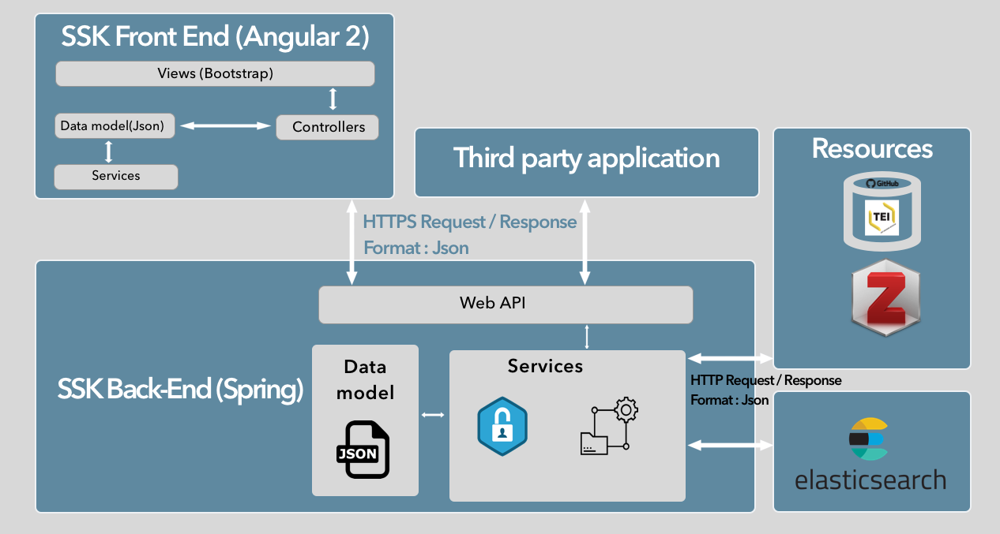

======================
Technical architecture
======================

The implementation of the SSK is based on a flexible, easy to deploy and
maintain architecture. It is composed of independent entities that
communicate together through services (REST / JSON).

* The main entity, the core of the SSK, is the back-end, which makes queries to our data
  repositories (Github, Zotero, etc.) and processes retrieved data.

* This core/back-end communicates with a search engine, part of the architecture,
  based on Apache Lucene:  ElasticSearch.

* The data processed from the core part and from the
  search engine are all delivered via an API to third-party applications
  like the SSK interface (the front-end), which is an entity of our architecture.

The architecture of the SSK is depicted in the following schema:

|image0|

SSK’s input
~~~~~~~~~~~

The SSK processes TEI files stored on Github and divided into two folders,
`scenarios <https://github.com/ParthenosWP4/SSK/tree/master/scenarios>`_ and `steps <https://github.com/ParthenosWP4/SSK/tree/master/steps>`_.
For more information about the data model, check the dedicated section: :ref:`reTEI`.

SSK Back-end
~~~~~~~~~~~~

This part is the main component of the SSK, it has been built using
**Spring Boot version 1.5.4.RELEASE**, a Java based framework (more details `here <https://spring.io/blog/2017/06/08/spring-boot-1-5-4-available-now>`_).
It contains modules for :

1 - Processing SSK data
^^^^^^^^^^^^^^^^^^^^^^^

This means retrieving TEI content from SSK Github repository. A very important step is to validate the
retrieved content according to the `RELAX NG schema <https://github.com/ParthenosWP4/SSK/blob/master/spec/TEI_SSK_ODD.rng>`__ defined for SSK files.

If the file is validated, TEI content is converted in JSON format using the built-in scripts provided by the TEI consortium : https://github.com/ParthenosWP4/SSK/blob/dev/SSK-Server/src/main/resources/lib/bin/teitojson.

The references contained in TEI files are resolved to complete the data:

* For keywords, in particular the ``standards``, the data retrieved in the TEI files is used to get extra information about the terms. For standards, a knowledge base of standards is queried to retrieve more informations (standard complete name, multilingual standard description and links).
* For resources, queries are made on platforms such as `Zotero <https://www.zotero.org/>`_ and **GitHub** (for project resources). **Website scraping** is also used to make resources more consistent.

Once the data is completed, it is then pushed into |elasticsearch| for indexing and search.

Note that each scenario and its steps are also pushed on |elasticsearch|. Each step is linked to the scenarios it is part of, by a parent attribute, directly in |elasticsearch|. Resources and descriptive metadata have been also targeted with their parent identifier in the same way.

2 - API serving
^^^^^^^^^^^^^^^

The SSK Back-End makes its data available via a REST API, built with Spring boot. This API allows third party applications to retrieve scenarios, steps, resources and their descriptive metadata.

The API V1 is accessible via the URL: http://ssk.huma-num.fr/ssk_services-0.0.1/ssk

Example queries:

* Get all the standards mentioned in scenarios and steps: http://ssk.huma-num.fr/ssk_services-0.0.1/standard/all
* To get the descriptive metadata of a scenario, the query is composed of the keyword ``scenario``, the Id of the scenario, and, as parameters, the metadata the user wants to get. For instance, the following query serves the title, description, image and descriptive terms for the scenario whose ID is ``SSK_sc_DisseminationFieldSurveys``:

``http://ssk.huma-num.fr/ssk_services-0.0.1/scenario/SSK_sc_DisseminationFieldSurveys?fields=title,desc,image,scenario_metadata,author&fromSSK=true``

A V2 is planned in order to serve more easy-to-handle content, for instance giving all the scenarios with a given author or related to a given institution, discipline or standard, etc.

3 - User management
^^^^^^^^^^^^^^^^^^^^

This part is still work in progress. We plan to deliver it by the **first trimester 2019**.

Creating an account will allow the user to:

* bookmark scenarios and steps in order to facilitate future navigations or stay in touch with some specific research fields.
* Create their own scenarios based on existing ones or by starting from scratch.

4 - Creation and update of scenarios
^^^^^^^^^^^^^^^^^^^^^^^^^^^^^^^^^^^^

We mentioned that it will be soon possible to create or update scenarios
from forms in the Front-End part of SSK. Meanwhile, it is also possible
to do so on our GitHub repository, via directly updating the TEI files.

To take into account these modifications or updates in our Elasticsearch
search engine, we use `GitHub webhooks <https://developer.github.com/webhooks/>`_ which allows us to
make POST requests to the Back-End. Thus an end-point in this module of
SSK (Back-End) receives the GitHub request and its data, processes these
data so that it can be pushed into Elasticsearch.

5 - Search Engine
^^^^^^^^^^^^^^^^^
The search engine module has been built in order to allow refined information retrieval. It relies on |elasticsearch|, version 6.2.4, a full-text search and analytics engine, that allows us to easily propose multi-criteria and full-text queries to the users, but also autocomplete suggestions.

The indexed data is not only the information contained in the scenarios and steps descriptions stored in TEI files, but also the data hosted on the `Zotero database <https://www.zotero.org/groups/427927/ssk-parthenos>`_ and the `SSK Standards Knowledge Base <http://ssk.huma-num.fr/#/glossary/standards>`_.

.. _sskFrontEnd:

SSK Front-End
~~~~~~~~~~~~~~
The SSK Front-End is the client part of the SSK, where users can see the SSK data (TEI files + Zotero references).

It is built with |angular_link|, a framework using |typescript| for building web applications. Angular proposes to set a hierarchy of components (or classes), associated with HTML templates. Components use services (or functions) to communicate with the server (to fetch the data for example) and to link components between them.

The image below (taken from https://angular.io/guide/architecture) shows the architecture of an Angular application.

|image1|

To display SSK's data on the web interface, we created several components, services and templates.

Components, combined with templates, are used to represent the different SSK layers : scenarios, steps, resources.

Services are used to share data between these layers, but they also allowed us to design functions that queries data from  main modules of the SSK (Core SSK or Back-End) via a REST API.

Deployment
~~~~~~~~~~

As the SSK is based on three main parts, each of its modules (Elasticsearch, Front-End, Back-End) need to be deployed independently. The communication between the modules is made with dedicated endpoints. The Elasticsearch endpoint serve the data to the Back-end, and in the same way, the Back-End also offers an endpoint to the Front-end so that it can get SSK's data for display.

1 - Install Elasticsearch
^^^^^^^^^^^^^^^^^^^^^^^^^

The binary packages of Elasticsearch have only one dependency: Java. The oldest supported version is Java 8. To download and install Elasticsearch, use the commands that work with your system (deb for Debian/Ubuntu, rpm for Redhat/Centos/Fedora, mac for OS X, and win for Windows). Follow |installelasticsearch| for  more details. After intalling Elastichsearch, run it with the **./elasticsearh** command from the **/bin**  installation forlder of Elasticsearch. and After that run this curl **curl -XPUT http://localhost:9200/ssk?pretty** to create SSK'index in Elasticsearch.

2 - Run SSK in Local
^^^^^^^^^^^^^^^^^^^^^^^^^^^^^^^^^^^^^^^^^^^^^
First be sure you have **gradle** installed on your computer, the actual version on wich the ssk is running on local computer is **4.1**. Clone the **dev** branch  on *https://github.com/ParthenosWP4/SSK* and you'll have many folder but the more updated version of the SSK are respectivly **SSK-Server** and **SSK_Client** for the Back-end ans the Front-end. 

Open each part with your favorite IDE. *IntellJ IDEA* is good for Back-end and *VisualStudio code* for the Front-End. Use gradle to install dependencies and run the Back-end with your IDE. The server-side of the SSK will then be available as an API service for the Front-End.
To run the Front-end part, insure to have the following configuarion on your computer for angular project by running ``ng  -version``.

|image2|

When all is ok, run **npm install** to install modules for the angular SSK Front-end, run the projet with ``ng serve`` and the application will be accessible through **http://localhost:4200/**.

3 - Build and deploy SSK on a remotre server (Huma-num in this case) 
^^^^^^^^^^^^^^^^^^^^^^^^^^^^^^^^^^^^^^^^^^^^^
The Back-End is composed of two main elements : **Spring Boot** and **Tomcat** (Java Servlet Container).

Spring Boot is a *convention over configuration* framework that allows us to set up a production-ready setup of a Spring project. By default, Spring Boot builds a standalone Java application that can run as a desktop application or be configured as a system service. For the SSK, we use it as a service.

Opposite to standalone applications, Tomcat is also installed as a service that can manage multiple applications within the same application process, avoiding the need for a specific setup for each application.

The SSK spring boot application use |gradle| as build automation system.

3.1 Build and deploy Back-End

To build a Tomcat-deployable WAR application for the Back-end part of the SSK, run the following gradle command ``gradle build -PonD4Science=false``.

 The WAR will be generated in ``target/ssk_services.war`` (assuming the Gradle artifactId is ``ssk_services``).

To have our WAR file deployed on Huma-num Tomcat SSK virtual machine, we need to complete the following steps:

1. Firt you will to credentials from Huma-num to access the SSK virtual machine
2. Copy our WAR file from target/ssk_services.war to the tomcat folder with a scp command like this : `` scp build/libs/ssk_services-0.0.1.war user_name@ssk.huma-num.fr:resource/tomcat/current/webapps``
3. The default tomcat of SSK virtual machine is hot deployment means that the server part (war file) with be automatically deployed just at the of the scp copy. Otherwise you could follow |Humnum| for more informations on Huma-Num virtual Machine.

This is how the SSK Back-End has been deployed on the Huma-Num infrastructure. There is already a SSK'Elasticsearch server on Huma-Num.

Source: |backdepoyment|

3.2 - Front-End Deployment (Angular application)
^^^^^^^^^^^^^^^^^^^^^^^^^^^^^^^^^^^^^^^^^^^^^^
Build and deploy the Front-end of the SSK which is an Angular based application, requires |angularcli| to be installed on your computer.

The steps to follow are:

1. To build angular applications, execute the ``ng build  --prod --base-href / --configuration=prod-huma-num``  command. This will generate files in the ``dist`` folder located at the root of the application folder.
2. Copy the whole content of ``dist`` folder to a folder on the server with **scp** as follow : ``scp -r dist/* user_name@ssk.huma-num.fr:www/web_main``

More details |angulardeployment|.

   

.. |image1| image:: img/overview2.png
   :width: 6.27083in
   :height: 3.34722in
 
 .. |image2| image:: ngversion.png
   :width: 6.27083in
   :height: 3.34722in

.. |angulardeployment| raw:: html

   <a href="https://angular.io/guide/deployment" target="_blank">here</a>

.. |angularcli| raw:: html

   <a href="https://angular.io/cli" target="_blank">Angular CLI</a>

.. |d4science| raw:: html

   <a href="https://www.d4science.org/" target="_blank">D4Science</a>

.. |downloadApacheTomcat| raw:: html

   <a href="https://www.elastic.co/products/elasticsearch" target="_blank">Download Apache Tomcat</a>

.. |elasticsearch| raw:: html

   <a href="https://www.elastic.co/products/elasticsearch" target="_blank">Elasticsearch</a>

.. |backdepoyment| raw:: html

   <a href="https://www.baeldung.com/spring-boot-war-tomcat-deploy" target="_blank">Deploy a Spring Boot WAR</a>

.. |gradle| raw:: html

   <a href="https://gradle.org/" target="_blank">Gradle</a>

.. |installelasticsearch| raw:: html

   <a href="https://www.elastic.co/guide/en/beats/libbeat/6.2/elasticsearch-installation.html" target="_blank">Install Elasticsearch</a>

.. |angular_link| raw:: html

   <a href="https://angular.io/" target="_blank">Angular 5.2.11</a>

.. |typescript| raw:: html

	<a href="https://www.typescriptlang.org/" target="_blank">Typescript 2.9.2</a>
	
.. |Humnum| raw:: html
   <a href="https://documentation.huma-num.fr/content/25/71/fr/l%E2%80%99hebergement-de-sites-web-chez-huma_num.html" target="_blank">L’hébergement de sites web chez Huma-Num</a>
